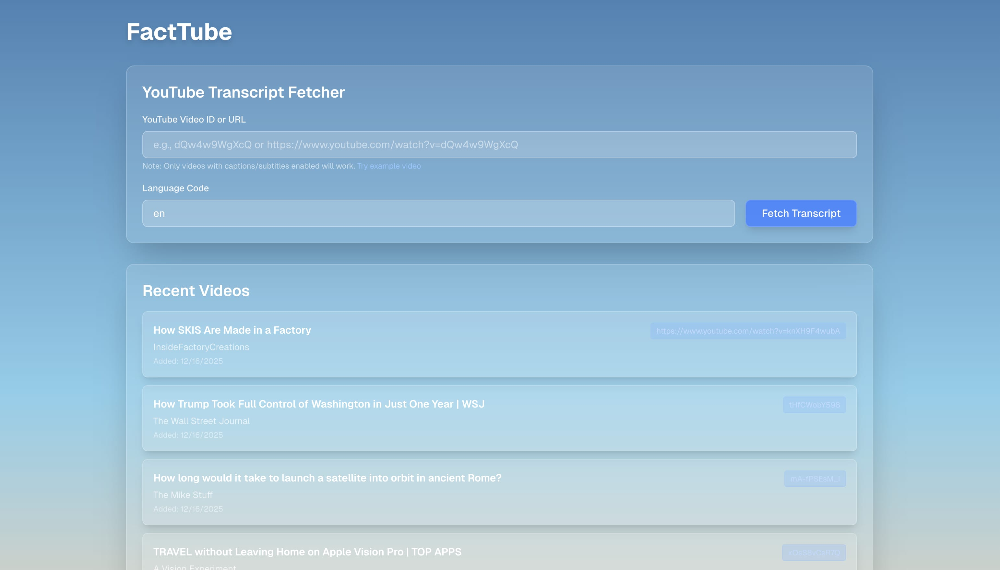

<div align="center">
  
  
  # FactTube
  
  **AI-powered fact-checking for YouTube videos**
  
  Extract claims from YouTube videos and verify them automatically using AI. Works with a Chrome extension for real-time fact-checking while you watch.
  
  [](https://opensource.org/licenses/MIT)
  
</div>

---

## 🎥 Demo

https://github.com/user-attachments/assets/your-video-id-here

> Watch FactTube in action as it analyzes YouTube videos in real-time and extracts verifiable claims.

## ✨ What It Does

- **📝 Extract Claims** - Automatically identifies factual claims from YouTube video transcripts
- **✅ Verify Facts** - Uses AI (OpenRouter + Perplexity) to verify each claim with sources
- **⚡ Real-time Results** - Shows verification results as you watch, with visual indicators
- **💾 Smart Caching** - Stores results for instant loading on repeat views

## 📸 Dashboard Preview

<div align="center">
  
  <p><em>View all analyzed videos and their fact-check results in one place</em></p>
</div>

---

## 🚀 Setup

### 1️⃣ Install

```bash
git clone <your-repo-url>
cd fact-tube
pnpm install
```

### 2️⃣ Configure (Optional)

Only needed if you want AI-powered fact-checking:

```bash
cp env.example .env.local
# Add your OPENROUTER_API_KEY to .env.local
```

Get an API key at [openrouter.ai/keys](https://openrouter.ai/keys)

### 3️⃣ Run

```bash
pnpm dev
```

Visit [http://localhost:3000](http://localhost:3000)

The app auto-creates a local SQLite database. No cloud setup required. ✨

---

## 🧩 Chrome Extension

### 📦 Install Extension

1. Open Chrome and go to `chrome://extensions/`
2. Enable **"Developer mode"** (top right)
3. Click **"Load unpacked"**
4. Select the `/public/chrome-extension` folder

### ⚙️ Configure Extension

1. Click the extension icon in Chrome
2. Enter your **OpenRouter API key**
3. Set backend URL to `http://localhost:3000`
4. Click **"Save Settings"**

### 🎬 Use It

1. Make sure the dev server is running (`pnpm dev`)
2. Go to any **YouTube video**
3. Click the **"Fact-Check"** button that appears
4. Watch claims appear with verification status in real-time! 🎉

---

## 🛠️ Tech Stack

| Technology | Purpose |
|------------|---------|
| **Next.js 15** | Web framework with App Router |
| **SQLite** | Local database (via libsql) |
| **tRPC** | Type-safe API layer |
| **OpenRouter** | AI claim extraction (GPT-4o-mini) |
| **Tailwind CSS** | Modern styling |
| **Drizzle ORM** | Database management |

---

## 📋 Commands

```bash
pnpm dev         # 🚀 Start dev server
pnpm build       # 📦 Build for production
pnpm lint        # 🔍 Lint code
pnpm db:studio   # 💾 View database in browser
```

---

## 🔄 How It Works


1. **📹 Extract** - Extension pulls transcript from YouTube video
2. **✂️ Chunk** - Backend splits transcript into manageable segments
3. **🤖 Analyze** - AI identifies factual claims in each segment
4. **💾 Store** - Claims saved to local SQLite database
5. **🔍 Verify** - Background worker fact-checks each claim with sources
6. **⚡ Stream** - Extension receives updates in real-time via Server-Sent Events
7. **🎯 Display** - Results appear on video timeline and as interactive popups

---

## 📄 License

MIT - Free for personal and commercial use

---

<div align="center">
  Made with ❤️ for truth and transparency
  
  [⭐ Star on GitHub](https://github.com/yourusername/fact-tube) • [🐛 Report Bug](https://github.com/yourusername/fact-tube/issues) • [✨ Request Feature](https://github.com/yourusername/fact-tube/issues)
</div>
